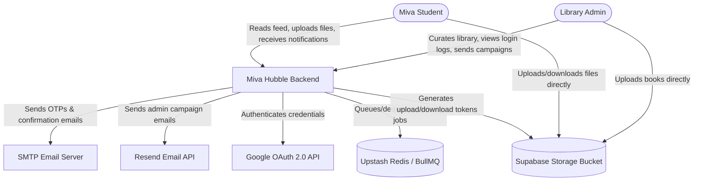
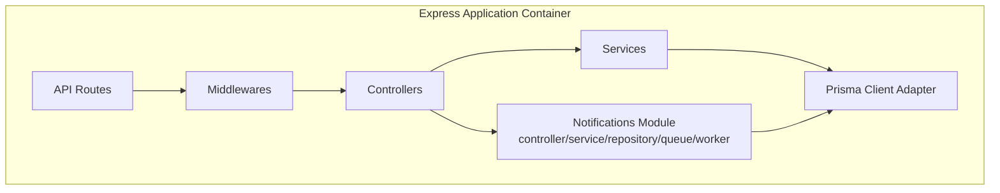
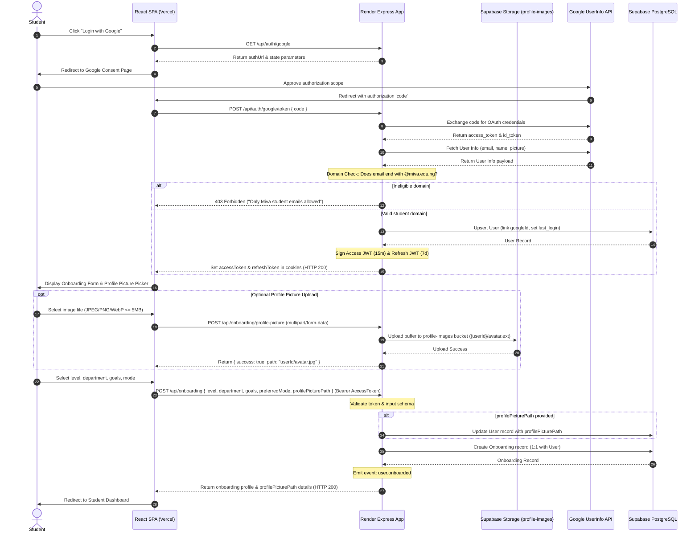
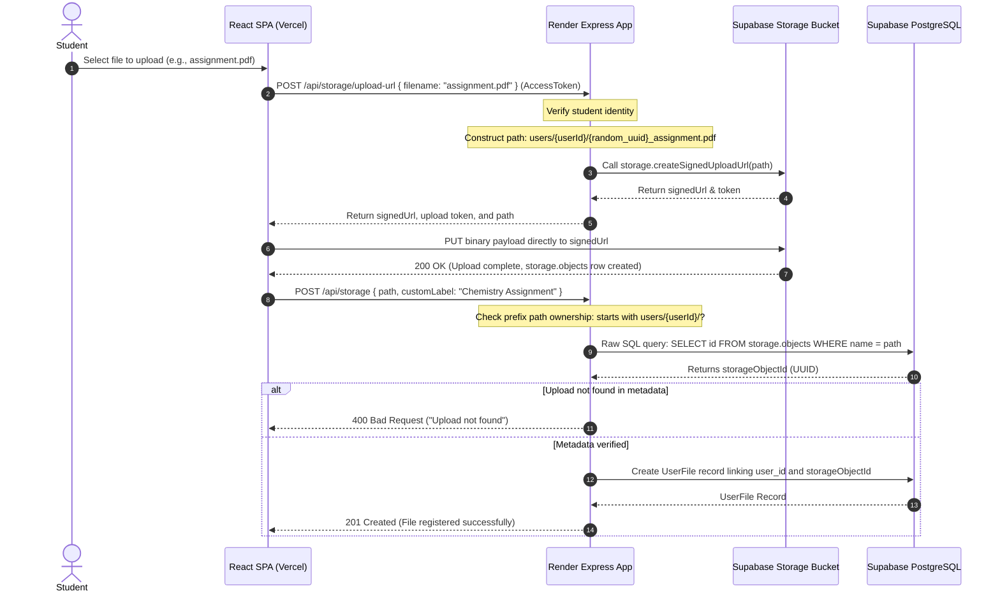
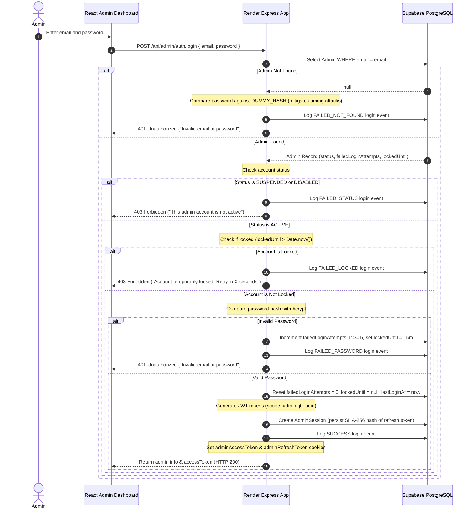
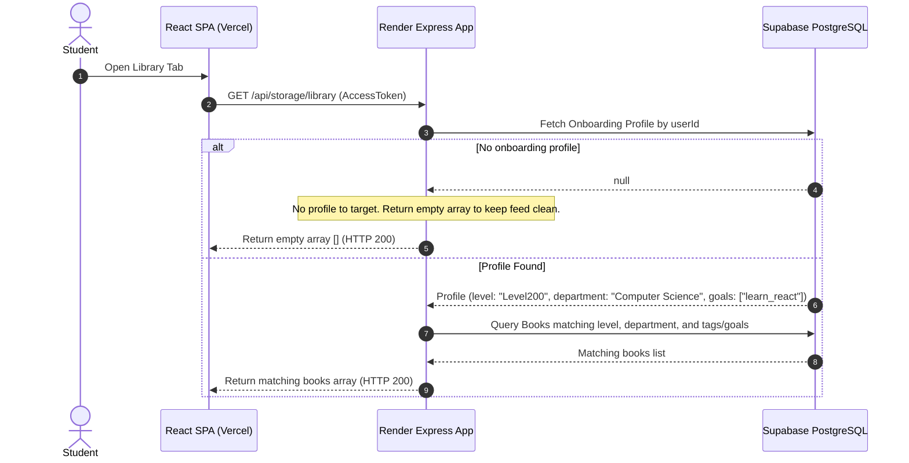
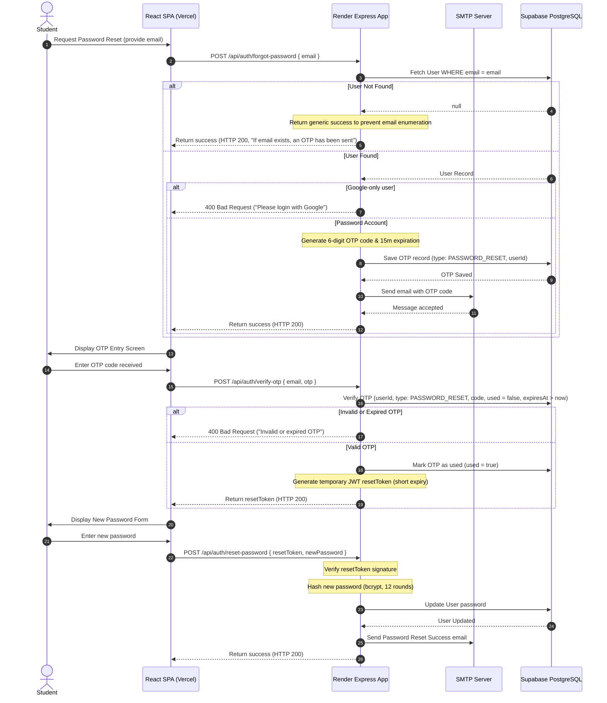

# Technical Architecture & Systems Overview: Miva Hubble Backend

---

## 1. Executive Summary

The **Miva Hubble Backend** is the core API gateway, business logic engine, and data orchestrator for the **Miva Open University** student resource and academic digital locker platform. It serves as a secure, high-performance middleware that facilitates profile onboarding, student personal file vaults, personalized library resource distribution, and admin-driven email notification campaigns.

The system is designed with a hybrid client-direct upload paradigm, enabling zero-bandwidth data transfer overhead for the core server runtime. By using strict domain restrictions, brute-force administrative lockout algorithms, database-backed session token rotation, and an asynchronous queue-backed notification engine, the backend guarantees a highly secure and observable environment for the university's digital assets and communications.

### Target Audiences
1. **Business Stakeholders & Library Administrators**: To understand security metrics, compliance with academic access rules, and automated resource/notification targeting.
2. **Software Engineers & Onboarding Engineers**: To serve as a single source of truth for architectural choices, request lifecycles, and backend service contracts.
3. **DevOps & Site Reliability Engineers (SREs)**: To understand deployment parameters, session state models, queue infrastructure, and horizontal scaling strategies.

---

## 2. Business Context

Miva Open University operates in a digital-first learning model. Academic materials (textbooks, lecture videos, past questions, and personal assignments) are the lifeblood of the student body. The Hubble platform bridges the gap between static cloud assets and active, personalized student engagement — and gives library administrators a way to reach students directly.

```
┌──────────────────────────────────────────────────────────────────────────┐
│                           STUDENT LIFE CYCLE                             │
├───────────────────┬──────────────────────────┬───────────────────────────┤
│ 1. Registration   │ 2. Profile Onboarding    │ 3. Active Learning        │
│ Google SSO & OTP  │ Select Level/Dept/Goals  │ Access Vault & Library    │
└───────────────────┴──────────────────────────┴───────────────────────────┘
                                                          │
                                                          ▼
                                          ┌──────────────────────────────┐
                                          │ 4. Targeted Communication     │
                                          │ Admin notification campaigns  │
                                          └──────────────────────────────┘
```

The business goals of the Hubble Backend are:
* **Academic Verification**: Restricting resource consumption exclusively to active, registered students belonging to the `@miva.edu.ng` domain.
* **Operational Cost Reduction**: Decreasing data egress charges from cloud services down to near-zero by routing bulk file uploads and downloads directly between client browsers and Object Storage.
* **Library Administration**: Enabling library curators to upload, classify, update, and deprecate educational items with high security.
* **Targeted Communication**: Enabling administrators to reach cohorts of students (by level/department) with email announcements, with full delivery observability.

---

## 3. Problem Statement

Prior implementations and standard web architectures face four main structural challenges:
1. **Network Egress Costs**: Routing massive files (such as 100MB PDF textbooks) through a Node.js/Express server causes high RAM utilization, blocks the single-threaded event loop, and duplicates data transfer fees (Storage → Backend → Client).
2. **Access Control Leakage**: Without domain restrictions and robust session management, administrative panels are vulnerable to credential stuffing, and proprietary textbooks can be leaked outside the university.
3. **Information Noise**: Presenting a generic library feed to students with different levels and departments reduces study efficiency. Resources must be algorithmically curated to match each student's specific curriculum.
4. **Synchronous Bulk Email**: Sending an email to hundreds/thousands of students inline within an HTTP request handler would block the request, retry unreliably, and give the admin no visibility into per-recipient delivery outcomes.

---

## 4. Goals and Non-Goals

### Goals
* Provide an Express API gateway with strict **Zod** request validation schema layers.
* Restrict registration and authentication strictly to emails ending with `@miva.edu.ng`.
* Enable client-direct uploads/downloads to Supabase Storage via signed URLs while maintaining absolute file registry ownership in the PostgreSQL database.
* Implement administrative brute-force lockout protections and secure database-backed session revocation.
* Deliver an automated, targeted library feed based on student department, level, and goals.
* Deliver admin-authored, level/department-targeted email campaigns asynchronously, with per-recipient delivery status and a durable audit trail.

### Non-Goals
* Managing real-time collaborative document editing or video call streaming.
* Handling student fee payments, processing tuition billing, or managing course registrations (managed by the ERP/LMS system).
* Acting as a general-purpose public file-sharing service.
* In-app push notifications (the `NotificationChannel.IN_APP` enum value is reserved in the schema but not implemented in the worker — every campaign dispatched today is `EMAIL` only).

---

## 5. System Overview

The Hubble Backend is built as a **Modular Monolith** in TypeScript utilizing the Express framework. It integrates:
* **Prisma ORM**: For type-safe database queries against a managed PostgreSQL instance (via `@prisma/adapter-pg`, the driver-adapter connection style).
* **Supabase Storage (S3-Compatible)**: For direct, secure binary file uploads and downloads.
* **Nodemailer / SMTP Service**: For transactional OTP delivery and password-reset verification emails only. See §5.1 for why this is distinct from the notification engine's email path.
* **Google OAuth2 API**: For secure Single Sign-On (SSO), via a manual `googleapis` authorization-code exchange (not Passport, despite `passport`/`passport-google-oauth20`/`passport-jwt` being present in `package.json` — those are unused dependencies).
* **BullMQ + Redis (Upstash)**: Background job queue for asynchronous notification delivery, decoupling campaign dispatch from actual email sends.
* **Resend**: Transactional email API used exclusively by the notification-campaign delivery path (`notification.worker.ts`).

### 5.1 Two Independent Email Paths

The codebase has **two separate email-sending mechanisms** that are easy to conflate and must be configured independently:

| Path | Purpose | Transport | Trigger |
| :--- | :--- | :--- | :--- |
| `MailService` (`services/mailService.ts`) | Registration OTP, login OTP, password-reset OTP, password-reset confirmation | Nodemailer over SMTP (`SMTP_HOST`/`PORT`/`USER`/`PASS`) | Synchronous, inline in `authController` request handlers |
| `ResendProvider` (`providers/email/resend.provider.ts`) | Admin notification campaigns | Resend API (`RESEND_API_KEY`) | Asynchronous, via BullMQ job in `notification.worker.ts` |

`.env.example` labels the SMTP configuration block "legacy — replaced by Resend" — that description applies **only** to the notification-campaign path. `MailService` has not been migrated and still depends entirely on SMTP being correctly configured; if `SMTP_*` is unset, OTP/password-reset email delivery fails at runtime even with Resend fully working.

---

## 6. Architecture Diagram

The system architecture is modeled according to the C4 software architecture model.

### 6.1 C4 Level 1: System Context Diagram



### 6.2 C4 Level 2: Container Diagram

```mermaid
graph TD
    subgraph Client Tier
        SPA[React SPA Client - Hosted on Vercel]
    end

    subgraph CDN & Gateway Tier
        Cloudflare[Cloudflare CDN & Proxy]
    end

    subgraph Application Tier
        RenderApp[Render Web Service - NodeJS Express API Container]
        RenderApp -.->|in-process BullMQ Worker| NotifWorker[Notification Worker]
    end

    subgraph External APIs
        Google[Google OAuth API]
        SMTP[SMTP Service / Nodemailer]
        Resend[Resend Email API]
    end

    subgraph Queue Tier
        UpstashRedis[(Upstash Redis)]
    end

    subgraph Data & Storage Tier (Supabase)
        SupabaseDB[(Supabase PostgreSQL Database)]
        SupabaseStorageBucket[Supabase Storage - resources bucket]
    end

    SPA -->|HTTPS| Cloudflare
    Cloudflare -->|HTTPS| RenderApp
    
    RenderApp -->|REST/OAuth| Google
    RenderApp -->|SMTP / Port 587| SMTP
    NotifWorker -->|Resend API| Resend
    RenderApp <-->|BullMQ protocol| UpstashRedis
    NotifWorker <-->|BullMQ protocol| UpstashRedis
    
    RenderApp -->|PostgreSQL Protocol / Port 6543| SupabaseDB
    RenderApp -->|Supabase JS SDK Client| SupabaseStorageBucket
    
    SPA -->|HTTPS Direct Uploads/Downloads| SupabaseStorageBucket
```

> **Note on the worker's runtime location:** `initNotificationWorker()` is called in-process from `src/index.ts` (same Node process as the Express app, unless `DISABLE_NOTIFICATION_WORKER=true`). It is **not** a separate deployed service today. If notification volume grows, this is a natural extraction point — see §21.5.

### 6.3 C4 Level 3: Component Diagram

The internal logical components within the Express Application container:



---

## 7. Component Responsibilities

| Logical Module | File Location & Reference | Core Responsibility |
| :--- | :--- | :--- |
| **API Entrypoint** | [index.ts](file:///C:/Users/HP/Desktop/Miva-Hubble-Backend/src/index.ts) | Initializes Express, parses CORS, cookie middleware, maps base routes, boots the notification worker, and registers the global error handler. |
| **Authentication Middleware** | [auth.ts](file:///C:/Users/HP/Desktop/Miva-Hubble-Backend/src/middleware/auth.ts) | Intercepts student HTTP requests, validates the Bearer token or HttpOnly `accessToken` cookie, and confirms the user still exists (DB lookup on every request). |
| **Admin Auth Middleware** | [adminAuth.ts](file:///C:/Users/HP/Desktop/Miva-Hubble-Backend/src/middleware/adminAuth.ts) | Restricts access to Admin endpoints; checks admin existence and active status. |
| **Validation Middleware** | [validate.ts](file:///C:/Users/HP/Desktop/Miva-Hubble-Backend/src/middleware/validate.ts) | Intercepts payloads before controllers and applies strict validation schemas via Zod. |
| **Upload Middleware** | [upload.ts](file:///C:/Users/HP/Desktop/Miva-Hubble-Backend/src/middleware/upload.ts) | Parses multipart form data for profile pictures via Multer (`memoryStorage`, JPEG/PNG/WebP, 5 MB limit). |
| **Student Controllers** | [authController.ts](file:///C:/Users/HP/Desktop/Miva-Hubble-Backend/src/controller/authController.ts) | Parses register, login, OTP validation, and password resets. Handles input and returns HTTP status codes. |
| **Google SSO Controllers** | [googleOAuthController.ts](file:///C:/Users/HP/Desktop/Miva-Hubble-Backend/src/controller/googleOAuthController.ts) | Coordinates the manual code exchange, pop-ups, redirects, and cookie-issuance for Google OAuth2. |
| **Onboarding Controllers** | [onboardController.ts](file:///C:/Users/HP/Desktop/Miva-Hubble-Backend/src/controller/onboardController.ts) | Completes academic onboarding and returns onboarding profile alongside student profile picture status. |
| **Profile Picture Controller** | [profilePictureController.ts](file:///C:/Users/HP/Desktop/Miva-Hubble-Backend/src/controller/profilePictureController.ts) | Handles standalone profile picture uploads and returns the generated Supabase Storage path. |
| **Admin Controllers** | [adminAuthController.ts](file:///C:/Users/HP/Desktop/Miva-Hubble-Backend/src/controller/adminAuthController.ts) | Manages admin logins, failed attempt trackers, lockout expirations, and active session creations. |
| **Storage & Feed Controllers** | [storageController.ts](file:///C:/Users/HP/Desktop/Miva-Hubble-Backend/src/controller/storageController.ts) | Exposes upload url requests, file registration endpoints, search/lists, and personalized feeds. |
| **Notification Controller** | [notification.controller.ts](file:///C:/Users/HP/Desktop/Miva-Hubble-Backend/src/modules/notifications/notification.controller.ts) | Admin campaign dispatch (`sendNotification`); student-facing read endpoints (`getUserNotifications`, `getNotificationStatus`) with IDOR-safe ownership checks. |
| **Notification Service** | [notification.service.ts](file:///C:/Users/HP/Desktop/Miva-Hubble-Backend/src/modules/notifications/notification.service.ts) | Resolves eligible recipients, creates the campaign + recipient rows transactionally, enqueues per-recipient delivery jobs. |
| **Notification Queue** | [notification.queue.ts](file:///C:/Users/HP/Desktop/Miva-Hubble-Backend/src/modules/notifications/notification.queue.ts) | Thin BullMQ `Queue` wrapper — job options (retries, backoff, retention), bulk enqueue. |
| **Notification Worker** | [notification.worker.ts](file:///C:/Users/HP/Desktop/Miva-Hubble-Backend/src/modules/notifications/notification.worker.ts) | BullMQ `Worker` — consumes delivery jobs, calls the email provider, updates recipient status + delivery-event audit trail, rolls up campaign completion. |
| **Notification Campaign Repository** | [notification-campaign.repository.ts](file:///C:/Users/HP/Desktop/Miva-Hubble-Backend/src/modules/notifications/notification-campaign.repository.ts) | All `NotificationCampaign` / `NotificationRecipient` / `NotificationDeliveryEvent` persistence — recipient targeting SQL, transactional campaign creation with `recipientCount` reconciliation, bounded delivery-event metadata. |
| **Profile Picture Service** | [profilePictureService.ts](file:///C:/Users/HP/Desktop/Miva-Hubble-Backend/src/services/profilePictureService.ts) | Uploads in-memory image buffers directly to Supabase Storage `profile-images` bucket. |
| **Onboarding Service** | [onboardingService.ts](file:///C:/Users/HP/Desktop/Miva-Hubble-Backend/src/services/onboardingService.ts) | Persists optional profile picture path to `User` table, creates `Onboarding` record, and emits event. |
| **Storage Service** | [storageService.ts](file:///C:/Users/HP/Desktop/Miva-Hubble-Backend/src/services/storageService.ts) | Contains algorithms for signed URL issuance, resolving Supabase physical files via SQL metadata lookups, and feed matching. |
| **Security & JWT Service** | [authService.ts](file:///C:/Users/HP/Desktop/Miva-Hubble-Backend/src/services/authService.ts) | Handles password hashing, password comparisons, and token verification. |
| **OTP Service** | [otpService.ts](file:///C:/Users/HP/Desktop/Miva-Hubble-Backend/src/services/otpService.ts) | Generates and verifies short-lived, single-use codes for password resets and verification. |
| **Mail Service** | [mailService.ts](file:///C:/Users/HP/Desktop/Miva-Hubble-Backend/src/services/mailService.ts) | Sends transactional OTP/password-reset emails via Nodemailer/SMTP. Distinct from the Resend-based notification campaign path — see §5.1. |
| **Email Provider Abstraction** | [email.provider.ts](file:///C:/Users/HP/Desktop/Miva-Hubble-Backend/src/providers/email/email.provider.ts), [resend.provider.ts](file:///C:/Users/HP/Desktop/Miva-Hubble-Backend/src/providers/email/resend.provider.ts) | `IEmailProvider` interface + Resend implementation, consumed only by `notification.worker.ts`. |
| **Event Broker** | [eventEmitter.ts](file:///C:/Users/HP/Desktop/Miva-Hubble-Backend/src/events/eventEmitter.ts) | Decouples post-onboarding tasks asynchronously inside the active Node process. |
| **Student Resource Controller** | [studentResourceController.ts](file:///C:/Users/HP/Desktop/Miva-Hubble-Backend/src/controller/studentResourceController.ts) | Student upload/submit/progress handlers plus admin review/archive handlers — both sides of the moderation boundary live in one file since they share the same underlying service. |
| **Progression Controller** | [progressionController.ts](file:///C:/Users/HP/Desktop/Miva-Hubble-Backend/src/controller/progressionController.ts) | Admin-only progression reporting (`GET /users/:userId/progression`, `GET /progression`) — no student-token path exists to either handler. |
| **Student Resource Service** | [studentResourceService.ts](file:///C:/Users/HP/Desktop/Miva-Hubble-Backend/src/services/studentResourceService.ts) | Upload URL issuance, fail-closed physical-metadata verification against `storage.objects`, DRAFT→PENDING_REVIEW submission with the 6/day Lagos-day rate limit, and the admin review/archive accounting transactions (§8.7). |
| **Progression Service** | [progressionService.ts](file:///C:/Users/HP/Desktop/Miva-Hubble-Backend/src/services/progressionService.ts) | Single source of truth for deriving `UserProgression` (daily goal, streak, rolling consistency, rank) from active `ResourceContribution` rows — shared by resource approval/archive, the student progress read, and admin progression reporting, so none of them can quietly disagree (§8.7). |
| **Lagos Time Helpers** | [lagosTime.ts](file:///C:/Users/HP/Desktop/Miva-Hubble-Backend/src/lib/lagosTime.ts) | `Africa/Lagos` calendar-day boundary and date-normalization helpers shared by `StudentResourceService` and `ProgressionService`, extracted to avoid a circular import between them. |

---

## 8. Data Flow

### 8.1 Student Google OAuth Login & Onboarding Setup



### 8.2 Student Secure File Upload & Metadata Registration

The server issues a presigned URL, the client performs the upload, and registers it.



> **Known validation gap:** `RequestUploadUrlSchema` requires and validates
> `contentType` (against an allowlist) and `sizeBytes` (against a 50MB cap),
> but neither field is currently passed through to
> `StorageService.createSignedUploadUrl` / Supabase's
> `createSignedUploadUrl` call. The validation therefore constrains the
> *request shape* but does not enforce what content-type is actually
> accepted by the physical upload — a client could pass a valid
> `contentType` to satisfy validation and then `PUT` a different file to
> the signed URL. `deriveFileFormat` (server-side, from the stored path's
> extension) is what actually determines `Book.fileFormat` after the fact,
> so this is not an integrity gap for that field — but the declared
> content-type restriction on upload is not enforced at the storage layer
> today. See §21.4.

### 8.3 Admin Login, Lockout & Session Revocation



### 8.4 Personalized Library Feed Generation



### 8.5 OTP-based Password Reset Lifecycle



> **Known security gap:** the `resetToken` returned by `verify-otp` is
> generated by `AuthService.generateAccessToken({ userId, email })` — the
> **exact same function, secret, and shape** as a normal login access
> token. `reset-password` verifies it with `AuthService.verifyAccessToken`
> and checks nothing beyond signature validity and `userId` existence.
> Unlike the admin token pair (which carries an explicit `scope: "admin"`
> claim, checked on every verify), the student reset token carries no
> claim distinguishing "this proves the OTP flow was completed" from "this
> is just a normal, valid, unexpired login session token." Practically:
> **any currently-valid student access token can be replayed against
> `POST /api/auth/reset-password` to change that account's password**,
> without ever going through the OTP step. Recommended fix: mint the reset
> token with a distinct claim (e.g. `purpose: "password_reset"`) and
> reject it in every other verification path, mirroring the admin token's
> `scope` pattern. See §21.4.

### 8.6 Admin Notification Campaign Dispatch & Delivery

```mermaid
sequenceDiagram
    autonumber
    actor Admin
    participant SPA as React Admin Dashboard
    participant API as Render Express App
    participant DB as Supabase PostgreSQL
    participant Queue as BullMQ / Upstash Redis
    participant Worker as Notification Worker (in-process)
    participant Resend as Resend Email API
    actor RecipientStudent as Student Recipient

    Admin->>SPA: Compose campaign (targetLevels, subject, body)
    SPA->>API: POST /api/admin/notifications/send (AdminToken, rate-limited 10/min/IP)
    Note over API: Validate + sanitize HTML body (allow-list tags/attrs)
    Note over API: createdByAdminId derived from req.admin — never from body
    API->>DB: SQL: find eligible Users by Onboarding.level/department (TARGET_ALL wildcard supported)
    DB-->>API: eligibleUsers[]
    alt No eligible students
        API-->>SPA: 400 Bad Request ("No eligible students found")
    else Eligible students found
        Note over API: Single transaction: create NotificationCampaign + all NotificationRecipient rows
        API->>DB: INSERT campaign (recipientCount = eligibleUsers.length, provisional)
        API->>DB: createMany NotificationRecipient rows
        API->>DB: Re-count persisted recipient rows; correct recipientCount to match if it drifted
        DB-->>API: campaign (recipientCount reconciled), recipients[]
        API->>Queue: addBulkJobs — one delivery job per recipient
        API->>DB: markCampaignStatus(PROCESSING)
        API-->>SPA: 202 Accepted { queuedCount, targetLevels }
        loop Per recipient (BullMQ concurrency: 5)
            Worker->>DB: updateRecipientStatus(PROCESSING)
            Worker->>Resend: sendEmail({ to, subject, html })
            alt Delivery succeeds
                Resend-->>Worker: { success: true, id }
                Worker->>DB: updateRecipientStatus(DELIVERED, providerMessageId, sentAt)
                Worker->>DB: appendDeliveryEvent(SENT) — metadata size/key-bounded before insert
            else Delivery fails
                Resend-->>Worker: { success: false, error }
                Worker->>DB: updateRecipientStatus(FAILED, lastError)
                Worker->>DB: appendDeliveryEvent(FAILED)
                Note over Worker: BullMQ retries — 5 attempts, exponential backoff (3s, 6s, 12s, 24s...)
            end
            Note over Worker: On job-terminal event only (completed, or failed with retries exhausted):
            Worker->>DB: maybeCompleteCampaign — marks campaign COMPLETED or FAILED once no recipients are PENDING/QUEUED/PROCESSING
        end
        Resend-->>RecipientStudent: Delivers email
    end
```

**Hardening notes (implemented):**
* `recipientCount` is never trusted from the pre-insert eligible-user count alone. `createCampaignWithRecipients` re-counts the actually-persisted `NotificationRecipient` rows inside the same transaction and corrects `recipientCount` before commit, so the campaign row and its recipient rows can never disagree. `recalculateRecipientCount(campaignId)` is available as a standalone reconciliation method for manual/periodic drift checks.
* `NotificationDeliveryEvent.metadata` is bounded at the single write path (`appendDeliveryEvent` → `sanitizeDeliveryMetadata`): max 20 keys, values truncated to 1000 chars, total serialized size capped at 2KB, with a `{ truncated: true }` fallback marker if a payload still exceeds the byte budget after truncation. This guards against a future provider integration passing large webhook payloads straight through into an append-only, unboundedly-growing table.
* `NotificationRecipient.updatedAt` (added via migration `20260815140000_add_notification_recipient_updated_at`) is stamped on every status transition, enabling a direct "recipients stuck in PROCESSING for > N minutes" operational query without reconstructing the timeline from `NotificationDeliveryEvent`.

### 8.7 Student Resource Submission → Admin Review → Progression

Full business rules (daily goal target, submission cap, streak/consistency
formulas, rank thresholds) are documented once, in `daily-goal-architecture.md`,
and are not repeated in full here — this section covers the request/data flow
that implements them. Domain separation: this feature has its own five tables
(`StudentResource`, `DailyGoal`, `ResourceContribution`, `RankDefinition`,
`UserProgression`) and never repurposes `UserFile`/`Book`.

**Lifecycle**: `DRAFT → PENDING_REVIEW → APPROVED → ARCHIVED` (or `→ REJECTED`
from `PENDING_REVIEW`). Every transition is guarded by an explicit current-status
check in `StudentResourceService` — e.g. only `PENDING_REVIEW` can be approved
or rejected, only `APPROVED` can be archived — so an out-of-order transition
fails closed with a descriptive error rather than silently succeeding.

```mermaid
sequenceDiagram
    autonumber
    actor Student
    participant SPA as React SPA
    participant API as Render Express App
    participant Storage as Supabase Storage (student-resources bucket)
    participant DB as Supabase PostgreSQL

    Student->>SPA: Select academic resource file
    SPA->>API: POST /api/student-resources/upload-url { filename, contentType, sizeBytes }
    API->>Storage: createSignedUploadUrl(student-resources/{userId}/{uuid}_filename)
    Storage-->>API: signedUrl, token
    API-->>SPA: signedUrl, token, path
    SPA->>Storage: PUT binary payload directly to signedUrl
    Storage-->>SPA: 200 OK (storage.objects row created)
    SPA->>API: POST /api/student-resources { path, title, level, department, courseCode, courseTitle, resourceType, contentType, sizeBytes }
    Note over API: Path ownership check (must start with student-resources/{userId}/)
    API->>DB: Raw SQL: SELECT id, metadata FROM storage.objects WHERE bucket_id=... AND name=path
    Note over API: Fail-closed: physical size/MIME must exist AND match declared sizeBytes/contentType
    API->>DB: Create StudentResource (status = DRAFT)
    DB-->>API: StudentResource row
    API-->>SPA: 201 Created
    Student->>SPA: Submit resource for review
    SPA->>API: POST /api/student-resources/:id/submit
    Note over API: Serializable transaction: only DRAFT is submittable;<br/>COUNT today's (Africa/Lagos) non-DRAFT submissions < 6
    API->>DB: UPDATE status = PENDING_REVIEW, submittedAt = now
    API-->>SPA: 200 OK
```

```mermaid
sequenceDiagram
    autonumber
    actor Admin
    participant SPA as React Admin Dashboard
    participant API as Render Express App
    participant DB as Supabase PostgreSQL

    Admin->>SPA: Open review queue
    SPA->>API: GET /api/admin/student-resources?status=PENDING_REVIEW&page=1&limit=20
    API->>DB: findMany WHERE status=PENDING_REVIEW ORDER BY submittedAt ASC (paginated)
    DB-->>API: resources[], total
    API-->>SPA: resources, pagination
    Admin->>SPA: Approve one resource
    SPA->>API: PATCH /api/admin/student-resources/:id/review { action: "APPROVE" }
    Note over API: Serializable transaction, all-or-nothing:
    API->>DB: 1. UPDATE StudentResource SET status=APPROVED, reviewedByAdminId, reviewedAt, approvedAt
    Note over API: 2. Compute Africa/Lagos activityDate from approvedAt
    API->>DB: 3. UPSERT DailyGoal (userId, activityDate)
    API->>DB: 4. CREATE ResourceContribution (studentResourceId UNIQUE, dailyGoalId)
    Note over API: studentResourceId is @unique — a second approval attempt<br/>(status recheck OR concurrent P2002) can never create a 2nd contribution
    API->>DB: 5. ProgressionService.recalculateUserProgression(userId) — full recompute, upsert UserProgression
    DB-->>API: updated StudentResource
    API-->>SPA: 200 OK { resource }
    Admin->>SPA: Reject a different resource
    SPA->>API: PATCH /api/admin/student-resources/:id/review { action: "REJECT", reason }
    Note over API: reason required by AdminReviewStudentResourceSchema (superRefine);<br/>only PENDING_REVIEW; no accounting side effects
    API->>DB: UPDATE status=REJECTED, reviewedByAdminId, reviewedAt, rejectionReason
    API-->>SPA: 200 OK { resource }
    Admin->>SPA: Archive a previously-approved resource
    SPA->>API: PATCH /api/admin/student-resources/:id/archive { reason? }
    Note over API: Serializable transaction; only APPROVED with an active (non-revoked) contribution
    API->>DB: UPDATE ResourceContribution SET revokedAt=now, revocationReason (never DELETE)
    API->>DB: UPDATE StudentResource SET status=ARCHIVED
    API->>DB: ProgressionService.recalculateUserProgression(userId) — re-derives day/streak/count/rank from what remains active
    API-->>SPA: 200 OK { resource }
```

**Why recalculation is always a full recompute, not an increment/decrement:**
`ProgressionService.recalculateUserProgression` reads every currently-active
(`revokedAt IS NULL`) `ResourceContribution` for the user, derives
`approvedResourceCount`, per-day completion, `currentStreak`/`longestStreak`,
and `lastCompletedGoalDate` from scratch, then upserts `UserProgression`. This
is what `daily-goal-architecture.md` §6/§8 calls "safe recalculation" —
revoking one contribution (archive) can never leave stale streak/rank state
behind, because nothing is ever incremented in place. `rank` is resolved by
finding the highest-threshold `RankDefinition` whose `minimumApprovedResources
<= approvedResourceCount` — config-driven (`rank_definitions`, seeded by
`pnpm seed:ranks`), never hardcoded thresholds in application logic.

**Student's own progress read** (`GET /api/student-resources/progress`, Gate 9)
is deliberately read-only — it never calls `recalculateUserProgression`, so
loading a dashboard can never side-effect a `UserProgression` row into
existence. A student who has never had a resource approved gets a computed
Novice/zero-state response instead of a persisted row.

---

## 9. API Contracts

All endpoints return JSON responses. If validation errors occur, a structured 400 Bad Request is returned.

### 9.1 Student Authentication (`/api/auth`)

Mounted in [auth.ts (Routes)](file:///C:/Users/HP/Desktop/Miva-Hubble-Backend/src/routes/auth.ts) and controlled by [authController.ts](file:///C:/Users/HP/Desktop/Miva-Hubble-Backend/src/controller/authController.ts).

#### 1. Google OAuth Initiation
* **HTTP Method**: `GET`
* **Path**: `/google`
* **Authentication**: None
* **Success Response (200 OK)**:
```json
{
  "success": true,
  "authUrl": "https://accounts.google.com/o/oauth2/v2/auth?access_type=offline...",
  "message": "Redirect user to this URL",
  "hd": "miva.edu.ng"
}
```

#### 2. Manual Registration
* **HTTP Method**: `POST`
* **Path**: `/register`
* **Authentication**: None
* **Request Body Schema ([RegisterSchema](file:///C:/Users/HP/Desktop/Miva-Hubble-Backend/src/schemas/auth.schema.ts#L26-L37))**:
```json
{
  "name": "Jane Doe",
  "username": "janedoe",
  "email": "jane.doe@miva.edu.ng",
  "password": "SecurePassword123!"
}
```
* **Success Response (201 Created)**:
```json
{
  "success": true,
  "redirectTo": "/otp",
  "message": "User registered. OTP sent to your email for verification"
}
```

#### 3. Standard Login
* **HTTP Method**: `POST`
* **Path**: `/login`
* **Authentication**: None
* **Request Body Schema ([LoginSchema](file:///C:/Users/HP/Desktop/Miva-Hubble-Backend/src/schemas/auth.schema.ts#L39-L42))**:
```json
{
  "email": "jane.doe@miva.edu.ng",
  "password": "SecurePassword123!"
}
```
* **Success Response (200 OK)**:
```json
{
  "success": true,
  "accessToken": "eyJhbGciOiJIUzI1NiIsInR5cCI6IkpXVCJ9...",
  "refreshToken": "eyJhbGciOiJIUzI1NiIsInR5cCI6IkpXVCJ9...",
  "message": "Login successful"
}
```

#### 4. Verify Registration OTP
* **HTTP Method**: `POST`
* **Path**: `/verify-email`
* **Authentication**: None
* **Request Body Schema ([VerifyOtpSchema](file:///C:/Users/HP/Desktop/Miva-Hubble-Backend/src/schemas/auth.schema.ts#L48-L51))**:
```json
{
  "email": "jane.doe@miva.edu.ng",
  "otp": "481029"
}
```
* **Success Response (200 OK)**:
```json
{
  "success": true,
  "accessToken": "eyJhbGci...",
  "refreshToken": "eyJhbGci...",
  "message": "Email verified successfully"
}
```

#### 5. Forgot Password Request
* **HTTP Method**: `POST`
* **Path**: `/forgot-password`
* **Authentication**: None
* **Request Body Schema ([ForgotPasswordSchema](file:///C:/Users/HP/Desktop/Miva-Hubble-Backend/src/schemas/auth.schema.ts#L44-L46))**:
```json
{
  "email": "jane.doe@miva.edu.ng"
}
```
* **Success Response (200 OK - Generic message returned even if email not found)**:
```json
{
  "success": true,
  "message": "If the email exists, an OTP has been sent"
}
```

#### 6. Verify Reset OTP
* **HTTP Method**: `POST`
* **Path**: `/verify-otp`
* **Authentication**: None
* **Request Body Schema ([VerifyOtpSchema](file:///C:/Users/HP/Desktop/Miva-Hubble-Backend/src/schemas/auth.schema.ts#L48-L51))**:
```json
{
  "email": "jane.doe@miva.edu.ng",
  "otp": "591028"
}
```
* **Success Response (200 OK)**:
```json
{
  "success": true,
  "resetToken": "eyJhbGciOiJIUzI1NiIsInR5cCI6IkpXVCJ9..."
}
```
* **Security note**: see §8.5 — this token is structurally identical to a normal login access token today.

#### 7. Complete Password Reset
* **HTTP Method**: `POST`
* **Path**: `/reset-password`
* **Authentication**: None
* **Request Body Schema ([ResetPasswordSchema](file:///C:/Users/HP/Desktop/Miva-Hubble-Backend/src/schemas/auth.schema.ts#L53-L62))**:
```json
{
  "resetToken": "eyJhbGciOiJIUzI1NiIsInR5cCI6IkpXVCJ9...",
  "newPassword": "NewSecurePassword456!"
}
```
* **Success Response (200 OK)**:
```json
{
  "success": true,
  "message": "Password reset successful"
}
```

#### 8. Token Refresh
* **HTTP Method**: `POST`
* **Path**: `/refresh`
* **Headers**: `Cookie: refreshToken=<JWT>`
* **Success Response (200 OK)**:
```json
{
  "success": true,
  "accessToken": "eyJhbGciOiJI..."
}
```

---

### 9.2 Student Profile & Onboarding

#### 1. Retrieve Current User
* **HTTP Method**: `GET`
* **Path**: `/api/user/me`
* **Authentication**: Student `AccessToken` (Bearer / Cookie)
* **Success Response (200 OK)**:
```json
{
  "user": {
    "id": "clz190axu0000abcde1234567",
    "email": "jane.doe@miva.edu.ng",
    "username": "janedoe",
    "name": "Jane Doe",
    "picture": "https://lh3.googleusercontent.com/a/...",
    "email_verified": true
  }
}
```

#### 2. Upload Profile Picture (Infrastructure Endpoint)
* **HTTP Method**: `POST`
* **Path**: `/api/onboarding/profile-picture`
* **Authentication**: Student `AccessToken` (Bearer / Cookie)
* **Request Header**: `Content-Type: multipart/form-data`
* **Body Form Field**: `image` (JPEG, PNG, or WebP file, max 5 MB)
* **Success Response (200 OK)**:
```json
{
  "success": true,
  "path": "clz190axu0000abcde1234567/avatar.jpg"
}
```

#### 3. Submit Onboarding Profile (Business Endpoint)
* **HTTP Method**: `POST`
* **Path**: `/api/onboarding`
* **Authentication**: Student `AccessToken` (Bearer / Cookie)
* **Request Body Schema ([onboardingSchema](file:///C:/Users/HP/Desktop/Miva-Hubble-Backend/src/schemas/validations/onboarding.schema.ts))**:
```json
{
  "level": "Level200",
  "department": "Computer Science",
  "goals": ["gpa_boost", "career_readiness"],
  "preferredMode": "IDENTIFIED",
  "profilePicturePath": "clz190axu0000abcde1234567/avatar.jpg"
}
```
* **Success Response (200 OK)**:
```json
{
  "success": true,
  "message": "Onboarding completed successfully.",
  "profile": {
    "level": "Level200",
    "department": "Computer Science",
    "goals": ["gpa_boost", "career_readiness"],
    "preferredMode": "identified",
    "profilePicturePath": "clz190axu0000abcde1234567/avatar.jpg",
    "isOnboarded": true,
    "onboardedAt": "2026-07-17T03:00:00.000Z"
  }
}
```

---

### 9.3 File Storage & Personal Library

Mounted in [storage.ts (Routes)](file:///C:/Users/HP/Desktop/Miva-Hubble-Backend/src/routes/storage.ts) and controlled by [storageController.ts](file:///C:/Users/HP/Desktop/Miva-Hubble-Backend/src/controller/storageController.ts).

#### 1. Request Signed Upload URL
* **HTTP Method**: `POST`
* **Path**: `/api/storage/upload-url`
* **Authentication**: Student `AccessToken`
* **Request Body Schema ([RequestUploadUrlSchema](file:///C:/Users/HP/Desktop/Miva-Hubble-Backend/src/schemas/storage.schema.ts#L9-L11))**: `filename`, `contentType`, `sizeBytes` are all validated (`contentType` against a PDF/EPUB/DOC/DOCX allowlist, `sizeBytes` against a 50MB cap) — but see §8.2's "Known validation gap": only `filename` is actually used downstream today.
```json
{
  "filename": "chemistry_assignment.pdf",
  "contentType": "application/pdf",
  "sizeBytes": 2400000
}
```
* **Success Response (200 OK)**:
```json
{
  "success": true,
  "signedUrl": "https://supabase.co/storage/v1/object/upload/sign/resources/users/userId/uuid_chemistry_assignment.pdf?token=...",
  "token": "signed_upload_token_here",
  "path": "users/clz190axu0000abcde1234567/41e16f39-d3e9-4e48-8df3-b3c10a4e320f_chemistry_assignment.pdf"
}
```

#### 2. Register Completed Upload
* **HTTP Method**: `POST`
* **Path**: `/api/storage`
* **Authentication**: Student `AccessToken`
* **Request Body Schema ([CreateFileSchema](file:///C:/Users/HP/Desktop/Miva-Hubble-Backend/src/schemas/storage.schema.ts#L13-L16))**:
```json
{
  "path": "users/clz190axu0000abcde1234567/41e16f39-d3e9-4e48-8df3-b3c10a4e320f_chemistry_assignment.pdf",
  "customLabel": "Chemistry Lab Report 1"
}
```
* **Success Response (201 Created)**:
```json
{
  "success": true,
  "file": {
    "id": "550e8400-e29b-41d4-a716-446655440000",
    "userId": "clz190axu0000abcde1234567",
    "storageObjectId": "550e8400-e29b-41d4-a716-446655440000",
    "customLabel": "Chemistry Lab Report 1",
    "isArchived": false,
    "createdAt": "2026-07-17T03:05:00.000Z",
    "updatedAt": "2026-07-17T03:05:00.000Z"
  }
}
```

#### 3. List Active Files
* **HTTP Method**: `GET`
* **Path**: `/api/storage`
* **Authentication**: Student `AccessToken`
* **Success Response (200 OK)**:
```json
{
  "success": true,
  "files": [
    {
      "id": "550e8400-e29b-41d4-a716-446655440000",
      "customLabel": "Chemistry Lab Report 1",
      "createdAt": "2026-07-17T03:05:00.000Z"
    }
  ]
}
```

#### 4. Soft-Archive File
* **HTTP Method**: `DELETE`
* **Path**: `/api/storage/:id`
* **Authentication**: Student `AccessToken`
* **Success Response (200 OK)**:
```json
{
  "success": true
}
```

#### 5. Generate Signed Download URL
* **HTTP Method**: `GET`
* **Path**: `/api/storage/:id/url?isBook=false`
* **Authentication**: Student `AccessToken`
* **Success Response (200 OK)**:
```json
{
  "success": true,
  "signedUrl": "https://supabase.co/storage/v1/object/sign/resources/...pdf?token=..."
}
```

#### 6. Get Personalized Library Feed
* **HTTP Method**: `GET`
* **Path**: `/api/storage/library`
* **Authentication**: Student `AccessToken`
* **Success Response (200 OK)**:
```json
{
  "success": true,
  "books": [
    {
      "id": "31a78400-e29b-41d4-a716-446655449999",
      "title": "Introduction to Computer Networks",
      "author": "Dr. A. Bello",
      "description": "Comprehensive Network Guide for Level 200",
      "level": "Level200",
      "department": "Computer Science",
      "bookType": "TEXTBOOK",
      "tags": ["gpa_boost"],
      "createdAt": "2026-07-17T01:00:00.000Z"
    }
  ]
}
```

---

### 9.4 Admin Portal & Library Management

Mounted in [admin.ts (Routes)](file:///C:/Users/HP/Desktop/Miva-Hubble-Backend/src/routes/admin.ts) and controlled by [adminAuthController.ts](file:///C:/Users/HP/Desktop/Miva-Hubble-Backend/src/controller/adminAuthController.ts) and [storageController.ts](file:///C:/Users/HP/Desktop/Miva-Hubble-Backend/src/controller/storageController.ts).

#### 1. Admin Login
* **HTTP Method**: `POST`
* **Path**: `/api/admin/auth/login`
* **Authentication**: None
* **Request Body Schema ([AdminLoginSchema](file:///C:/Users/HP/Desktop/Miva-Hubble-Backend/src/schemas/admin.schema.ts#L8-L11))**:
```json
{
  "email": "library.curator@miva.edu.ng",
  "password": "SecretAdminPassword123!"
}
```
* **Success Response (200 OK - Sets `adminAccessToken` & `adminRefreshToken` cookies)**:
```json
{
  "admin": {
    "id": "clz190admin0000abcde987654",
    "name": "Library Curator",
    "email": "library.curator@miva.edu.ng"
  },
  "accessToken": "eyJhbGciOiJIUzI1NiIsIn...",
  "expiresIn": 900
}
```

#### 2. Refresh Admin Token
* **HTTP Method**: `POST`
* **Path**: `/api/admin/auth/refresh`
* **Headers**: `Cookie: adminRefreshToken=<JWT>`
* **Success Response (200 OK)**:
```json
{
  "accessToken": "eyJhbGci...",
  "expiresIn": 900
}
```

#### 3. Admin Logout
* **HTTP Method**: `POST`
* **Path**: `/api/admin/auth/logout`
* **Success Response (200 OK)**:
```json
{
  "success": true,
  "message": "Logged out"
}
```

#### 4. Get Current Admin
* **HTTP Method**: `GET`
* **Path**: `/api/admin/auth/me`
* **Authentication**: Admin `AccessToken`
* **Success Response (200 OK)**:
```json
{
  "admin": { "id": "clz190admin0000abcde987654", "email": "library.curator@miva.edu.ng" }
}
```

#### 5. Request Admin Book Upload URL
* **HTTP Method**: `POST`
* **Path**: `/api/admin/storage/books/upload-url`
* **Authentication**: Admin `AccessToken`
* **Success Response (200 OK)**:
```json
{
  "success": true,
  "signedUrl": "https://supabase.co/storage/v1/object/upload/sign/resources/books/global/uuid_textbook.pdf?token=...",
  "token": "admin_upload_token",
  "path": "books/global/41e16f39-d3e9-4e48-8df3-b3c10a4e320f_textbook.pdf"
}
```

#### 6. Register Curated Book
* **HTTP Method**: `POST`
* **Path**: `/api/admin/storage/books`
* **Authentication**: Admin `AccessToken`
* **Request Body Schema ([CreateBookSchema](file:///C:/Users/HP/Desktop/Miva-Hubble-Backend/src/schemas/storage.schema.ts#L18-L27))**:
```json
{
  "path": "books/global/41e16f39-d3e9-4e48-8df3-b3c10a4e320f_textbook.pdf",
  "title": "Computer Networks 101",
  "author": "Dr. Andrew Tanenbaum",
  "description": "Standard textbooks on computer networking",
  "level": "Level200",
  "department": "Computer Science",
  "bookType": "TEXTBOOK",
  "tags": ["gpa_boost", "network_basics"],
  "status": "PUBLISHED"
}
```
* **Success Response (201 Created)**:
```json
{
  "success": true,
  "book": {
    "id": "31a78400-e29b-41d4-a716-446655449999",
    "title": "Computer Networks 101",
    "status": "PUBLISHED"
  }
}
```

#### 7. List Books (Admin)
* **HTTP Method**: `GET`
* **Path**: `/api/admin/storage/books?status=PUBLISHED`
* **Authentication**: Admin `AccessToken`
* **Success Response (200 OK)**: array of all `Book` rows, optionally filtered by `status`.

#### 8. Update Book
* **HTTP Method**: `PATCH`
* **Path**: `/api/admin/storage/books/:id`
* **Authentication**: Admin `AccessToken`
* **Request Body Schema ([UpdateBookSchema](file:///C:/Users/HP/Desktop/Miva-Hubble-Backend/src/schemas/storage.schema.ts))**: any subset of the `CreateBookSchema` fields (at least one required).

#### 9. Delete Book
* **HTTP Method**: `DELETE`
* **Path**: `/api/admin/storage/books/:id`
* **Authentication**: Admin `AccessToken`
* **Success Response (200 OK)**:
```json
{
  "success": true
}
```
* Deletes the physical Supabase Storage object first, then the `Book` row (treats "already gone" as success — see `StorageService.deleteBook`).

#### 10. Send Notification Campaign
* **HTTP Method**: `POST`
* **Path**: `/api/admin/notifications/send`
* **Authentication**: Admin `AccessToken`
* **Rate Limit**: 10 requests / minute / IP (`express-rate-limit`)
* **Request Body Schema ([createNotificationSchema](file:///C:/Users/HP/Desktop/Miva-Hubble-Backend/src/modules/notifications/notification.validation.ts))**:
```json
{
  "targetLevels": ["Level200", "Level300"],
  "targetDepartments": ["Computer Science"],
  "subject": "Mid-semester exam schedule released",
  "body": "<p>Check the library tab for your updated timetable.</p>",
  "metadata": { "campaignTag": "exam-schedule-2026" }
}
```
  * `targetLevels` / `targetDepartments`: send `["All"]` alone to target every level/department; mixing `"All"` with specific values is rejected as ambiguous.
  * `body` is passed through `sanitize-html` with an explicit tag/attribute allow-list before storage or delivery — no inline `style`, no scripts, no iframes.
  * `metadata`: max 20 keys, max 10KB serialized, primitive values only (no nested objects/arrays).
  * `userId` and `channel` are **not** accepted from the client — recipients are resolved server-side from `targetLevels`/`targetDepartments`, and `channel` is implicitly `EMAIL` (the only implemented delivery channel).
* **Success Response (202 Accepted)**:
```json
{
  "success": true,
  "message": "Notification batch accepted and queued for delivery",
  "data": {
    "queuedCount": 447,
    "targetLevels": ["Level200", "Level300"]
  }
}
```
* **Error Response (400 Bad Request — no eligible students)**:
```json
{
  "success": false,
  "message": "No eligible students found for levels: Level200, Level300"
}
```

---

### 9.5 Student Notifications (Read-Only)

Mounted in [notification.routes.ts](file:///C:/Users/HP/Desktop/Miva-Hubble-Backend/src/modules/notifications/notification.routes.ts). Dispatch (`POST /send`) intentionally does **not** live on this router — see the inline comment in the source: it was previously reachable by any authenticated student, which was a live authorization gap, and has been moved to the admin-gated route at §9.4.10.

#### 1. Get My Notifications
* **HTTP Method**: `GET`
* **Path**: `/api/notifications/user/me`
* **Authentication**: Student `AccessToken`
* **Success Response (200 OK)**:
```json
{
  "success": true,
  "data": [
    {
      "id": "9f1c2e40-...-uuid",
      "email": "jane.doe@miva.edu.ng",
      "status": "DELIVERED",
      "sentAt": "2026-08-15T09:00:00.000Z",
      "updatedAt": "2026-08-15T09:00:05.000Z",
      "campaign": {
        "title": "Mid-semester exam schedule released",
        "subject": "Mid-semester exam schedule released",
        "message": "<p>Check the library tab for your updated timetable.</p>",
        "channel": "EMAIL",
        "createdAt": "2026-08-15T08:59:00.000Z"
      }
    }
  ]
}
```

#### 2. Get Notification Status by ID
* **HTTP Method**: `GET`
* **Path**: `/api/notifications/:id`
* **Authentication**: Student `AccessToken`
* **Ownership check**: returns `404 Not Found` (never `403`, to avoid leaking existence) if the notification's `userId` doesn't match the requesting student — an IDOR-safe pattern.

---

### 9.6 Student Resource Progression

Student-facing endpoints mounted in [studentResource.ts (Routes)](file:///C:/Users/HP/Desktop/Miva-Hubble-Backend/src/routes/studentResource.ts) at `/api/student-resources`; admin endpoints mounted in [admin.ts (Routes)](file:///C:/Users/HP/Desktop/Miva-Hubble-Backend/src/routes/admin.ts) at `/api/admin`. Both are backed by [studentResourceController.ts](file:///C:/Users/HP/Desktop/Miva-Hubble-Backend/src/controller/studentResourceController.ts), [progressionController.ts](file:///C:/Users/HP/Desktop/Miva-Hubble-Backend/src/controller/progressionController.ts), [studentResourceService.ts](file:///C:/Users/HP/Desktop/Miva-Hubble-Backend/src/services/studentResourceService.ts), and [progressionService.ts](file:///C:/Users/HP/Desktop/Miva-Hubble-Backend/src/services/progressionService.ts). See §8.7 for the full lifecycle/accounting sequence diagrams.

#### 1. Request Signed Upload URL
* **HTTP Method**: `POST`
* **Path**: `/api/student-resources/upload-url`
* **Authentication**: Student `AccessToken`
* **Request Body Schema** ([RequestStudentResourceUploadUrlSchema](file:///C:/Users/HP/Desktop/Miva-Hubble-Backend/src/schemas/studentResource.schema.ts)): `filename`, `contentType` (PDF/EPUB/DOC/DOCX allowlist), `sizeBytes` (≤ 50MB).
* **Success Response (200 OK)**:
```json
{
  "success": true,
  "signedUrl": "https://supabase.co/storage/v1/object/upload/sign/student-resources/...",
  "token": "signed_upload_token_here",
  "path": "student-resources/clz190.../41e16f39-..._notes.pdf",
  "contentType": "application/pdf",
  "sizeBytes": 2400000
}
```

#### 2. Register Completed Upload (DRAFT)
* **HTTP Method**: `POST`
* **Path**: `/api/student-resources`
* **Authentication**: Student `AccessToken`
* **Request Body Schema** ([CreateStudentResourceSchema](file:///C:/Users/HP/Desktop/Miva-Hubble-Backend/src/schemas/studentResource.schema.ts)):
```json
{
  "path": "student-resources/clz190.../41e16f39-..._notes.pdf",
  "title": "CSC201 Midterm Notes",
  "description": "Chapters 1-4 summary",
  "level": "Level200",
  "department": "Computer Science",
  "courseCode": "CSC201",
  "courseTitle": "Data Structures",
  "resourceType": "NOTE",
  "contentType": "application/pdf",
  "sizeBytes": 2400000
}
```
* **Success Response (201 Created)**: `{ "success": true, "resource": { "id": "...", "status": "DRAFT", ... } }`
* **Error Response (400)**: fail-closed physical-metadata mismatch (`"Physical file size mismatch..."`), unowned path (`"Upload path does not belong to this user"`), or duplicate registration (`"This upload has already been registered"`).

#### 3. Submit for Review
* **HTTP Method**: `POST`
* **Path**: `/api/student-resources/:id/submit`
* **Authentication**: Student `AccessToken`
* **Success Response (200 OK)**: `{ "success": true, "resource": { "status": "PENDING_REVIEW", "submittedAt": "..." } }`
* **Error Response (400/404)**: `"Only DRAFT resources can be submitted for review..."`, `"Daily submission limit reached (maximum 6 submissions per day)"`, or `"Resource not found or unauthorized"` (cross-user access — deliberately the same message whether the resource doesn't exist or belongs to someone else).

#### 4. Get Own Progress
* **HTTP Method**: `GET`
* **Path**: `/api/student-resources/progress`
* **Authentication**: Student `AccessToken` — `userId` always comes from the verified token, never a route param, so this endpoint has no cross-user variant to guard against.
* **Success Response (200 OK)**:
```json
{
  "success": true,
  "dailyGoal": { "activeCount": 2, "target": 3, "percentage": 66, "completed": false },
  "streak": { "current": 4, "longest": 9 },
  "consistency": { "windowDays": 7, "eligibleDays": 7, "completedDays": 5, "percentage": 71 },
  "rank": {
    "name": "Amateur",
    "level": 2,
    "approvedResourceCount": 14,
    "nextRank": { "name": "Senior", "minimumApprovedResources": 20, "resourcesRemaining": 6 }
  }
}
```
`rank.nextRank` is `null` for a student already at Ultimate (level 10).

#### 5. Admin: Review Queue
* **HTTP Method**: `GET`
* **Path**: `/api/admin/student-resources?status=PENDING_REVIEW&page=1&limit=20`
* **Authentication**: Admin `AccessToken`
* **Query Schema** ([AdminListStudentResourcesQuerySchema](file:///C:/Users/HP/Desktop/Miva-Hubble-Backend/src/schemas/studentResource.schema.ts)): `status` optional (any `StudentResourceStatus`), `page` (default 1), `limit` (default 20, max 100).
* **Success Response (200 OK)**:
```json
{
  "success": true,
  "resources": [
    {
      "id": "...", "title": "CSC201 Midterm Notes", "status": "PENDING_REVIEW",
      "submittedAt": "...",
      "user": { "id": "...", "name": "Jane Doe", "email": "jane.doe@miva.edu.ng", "username": "janedoe" }
    }
  ],
  "pagination": { "page": 1, "limit": 20, "total": 47, "totalPages": 3 }
}
```
Ordered oldest-`submittedAt`-first, matching the `[status, submittedAt]` index built specifically for this query (see `prisma/schema.prisma`'s `StudentResource` model).

#### 6. Admin: Approve / Reject
* **HTTP Method**: `PATCH`
* **Path**: `/api/admin/student-resources/:id/review`
* **Authentication**: Admin `AccessToken`
* **Request Body Schema** ([AdminReviewStudentResourceSchema](file:///C:/Users/HP/Desktop/Miva-Hubble-Backend/src/schemas/studentResource.schema.ts)):
```json
{ "action": "APPROVE" }
```
or
```json
{ "action": "REJECT", "reason": "Duplicate of an existing approved resource" }
```
`reason` is enforced as required for `REJECT` via a Zod `superRefine` (not accepted/required for `APPROVE`).
* **Success Response (200 OK)**: `{ "success": true, "resource": { "status": "APPROVED", "approvedAt": "...", "reviewedByAdminId": "..." } }`
* **Error Response (409 Conflict)**: `"Only PENDING_REVIEW resources can be reviewed. Current status: ..."` or `"This resource has already been approved and counted"` (the `ResourceContribution.studentResourceId` unique-constraint race case).

#### 7. Admin: Archive
* **HTTP Method**: `PATCH`
* **Path**: `/api/admin/student-resources/:id/archive`
* **Authentication**: Admin `AccessToken`
* **Request Body Schema** ([AdminArchiveStudentResourceSchema](file:///C:/Users/HP/Desktop/Miva-Hubble-Backend/src/schemas/studentResource.schema.ts)): `{ "reason": "Retroactively disqualified — plagiarism report" }` (optional; defaults to `"Archived by admin"` if omitted).
* **Success Response (200 OK)**: `{ "success": true, "resource": { "status": "ARCHIVED" } }`
* **Error Response (400)**: `"Only APPROVED resources can be archived. Current status: ..."` or `"Resource has no active contribution to revoke"`.

#### 8. Admin: One User's Progression
* **HTTP Method**: `GET`
* **Path**: `/api/admin/users/:userId/progression`
* **Authentication**: Admin `AccessToken`
* **Success Response (200 OK)**: same shape as endpoint 4, plus:
```json
{
  "success": true,
  "user": { "id": "...", "name": "Jane Doe", "username": "janedoe", "email": "jane.doe@miva.edu.ng" },
  "dailyGoal": { "...": "..." },
  "streak": { "...": "..." },
  "consistency": { "...": "..." },
  "rank": { "...": "..." },
  "recentDays": [
    { "date": "2026-08-29", "activeCount": 3, "percentage": 100, "completed": true }
  ]
}
```
* **Error Response (404)**: `"User not found"`.

#### 9. Admin: Progression Roster
* **HTTP Method**: `GET`
* **Path**: `/api/admin/progression?rankLevel=2&search=jane&page=1&limit=20`
* **Authentication**: Admin `AccessToken`
* **Query Schema** ([AdminListProgressionQuerySchema](file:///C:/Users/HP/Desktop/Miva-Hubble-Backend/src/schemas/progression.schema.ts)): `page`, `limit` (max 100), `rankLevel` (1–10, optional), `search` (name/username/email `ILIKE`, wildcard-escaped, optional).
* **Success Response (200 OK)**:
```json
{
  "success": true,
  "users": [
    {
      "id": "...", "name": "Jane Doe", "username": "janedoe", "email": "jane.doe@miva.edu.ng",
      "rank": { "name": "Amateur", "level": 2 },
      "approvedResourceCount": 14,
      "streak": { "current": 4, "longest": 9 },
      "consistency": { "windowDays": 7, "eligibleDays": 7, "completedDays": 5, "percentage": 71 }
    }
  ],
  "pagination": { "page": 1, "limit": 20, "total": 812, "totalPages": 41 }
}
```
Backed by a single `$queryRaw` (CTEs + a window-function total count) rather than per-user Prisma calls in a loop, to avoid an N+1 query per page — see the doc comment on `ProgressionService.listUserProgression`. Users without a `UserProgression` row yet fall back to Novice/zeroed counters, matching endpoint 4's default.

---

## 10. Database Interactions

The database structure is defined in [schema.prisma](file:///C:/Users/HP/Desktop/Miva-Hubble-Backend/prisma/schema.prisma).

### 10.1 Core Entity Relationships

```
                  ┌──────────────────────┐
                  │        User          │
                  └──────────┬───────────┘
                             │ 1:1
              ┌──────────────┴──────────────┐
              │          Onboarding         │
              └─────────────────────────────┘
                             │ 1:N
             ┌───────────────┼───────────────┬──────────────────────┐
             │               │               │                      │
             ▼ 1:N           ▼ 1:N           ▼ 1:N                  ▼ 1:N
      ┌────────────┐   ┌────────────┐   ┌────────────┐   ┌────────────────────┐
      │    Otp     │   │  UserFile  │   │   Admin    │   │ NotificationRecipient│
      └────────────┘   └────────────┘   └──────┬─────┘   └──────────┬──────────┘
                                               │                     │ N:1
                                       ┌───────┴───────┐             ▼
                                       │ 1:N           │ 1:N   ┌──────────────────┐
                                       ▼               ▼       │NotificationCampaign│
                               ┌─────────────┐   ┌─────────────┐└──────────────────┘
                               │AdminSession │   │AdminLoginEvt│         ▲ N:1 (createdByAdminId)
                               └─────────────┘   └─────────────┘         │
                                       Admin ─────────────────────────────┘
```

`NotificationRecipient` also has a 1:N relation to `NotificationDeliveryEvent` (the append-only per-status-transition audit log) — omitted above for diagram clarity.

### 10.2 Prisma Models & Enums

* **LoginProvider**: `GOOGLE` | `NORMAL`
* **OtpType**: `EMAIL_VERIFICATION` | `PASSWORD_RESET`
* **PreferredMode**: `ANONYMOUS` | `IDENTIFIED`
* **AdminStatus**: `ACTIVE` | `SUSPENDED` | `DISABLED`
* **AdminLoginEventType**: `SUCCESS` | `FAILED_NOT_FOUND` | `FAILED_PASSWORD` | `FAILED_STATUS` | `FAILED_LOCKED`
* **BookType**: `TEXTBOOK` | `PAST_QUESTION` | `STUDY_GUIDE` | `REFERENCE`
* **BookStatus**: `DRAFT` | `PUBLISHED` | `ARCHIVED`
* **FileFormat**: `PDF` | `EPUB` | `DOC` | `DOCX` — mirrors `ALLOWED_UPLOAD_MIME_TYPES`; derived server-side from the stored path's extension, never client-supplied.
* **NotificationStatus**: `PENDING` | `QUEUED` | `PROCESSING` | `DELIVERED` | `FAILED`
* **NotificationChannel**: `EMAIL` | `IN_APP` — only `EMAIL` is implemented in the worker today.
* **CampaignStatus**: `DRAFT` | `SCHEDULING` | `QUEUED` | `PROCESSING` | `COMPLETED` | `FAILED` | `CANCELED`
* **DeliveryEventType**: `QUEUED` | `SENDING` | `SENT` | `DELIVERED` | `BOUNCED` | `FAILED` | `RETRYING`
* **StudentResourceStatus**: `DRAFT` | `PENDING_REVIEW` | `APPROVED` | `REJECTED` | `ARCHIVED`
* **StudentResourceType**: `NOTE` | `PAST_QUESTION` | `STUDY_GUIDE` | `REFERENCE`

#### Relational Schemas Table

| Model Name | Field Definitions | Indexes / Relations |
| :--- | :--- | :--- |
| **User** | `id` (cuid, PK), `email` (unique), `username` (unique), `name`, `password` (hashed, nullable), `googleId` (unique, nullable), `picture`, `profilePicturePath` (nullable avatar path), `last_login_with`, `last_login_at`, `email_verified` (boolean), `email_verified_at`, `createdAt`, `updatedAt` | Relates to `Otp` (1:N), `Onboarding` (1:1), `UserFile` (1:N), `Notification` (1:N, legacy path), `NotificationRecipient` (1:N). |
| **Otp** | `id` (cuid, PK), `code` (string), `type` (enum), `expiresAt`, `used` (boolean), `userId`, `createdAt` | Composite Index on `[userId, type]`. Cascade deletes with `User`. |
| **Onboarding** | `id` (cuid, PK), `level`, `department`, `goals` (string[]), `preferredMode`, `completedAt`, `userId` | Unique constraint on `userId`. 1:1 relation with `User`. |
| **Admin** | `id` (cuid, PK), `name`, `email` (unique), `password` (hashed), `status` (AdminStatus), `failedLoginAttempts` (int), `lockedUntil`, `lastLoginAt`, `createdAt`, `updatedAt` | Relates to `AdminSession` (1:N), `AdminLoginEvent` (1:N), `Notification` (1:N, legacy), `NotificationCampaign` (1:N). |
| **AdminSession** | `id` (cuid, PK), `refreshTokenHash` (unique, SHA-256), `userAgent`, `ip`, `expiresAt`, `revokedAt`, `createdAt`, `adminId` | Index on `adminId`. |
| **AdminLoginEvent** | `id` (cuid, PK), `email`, `type` (AdminLoginEventType), `ip`, `userAgent`, `createdAt`, `adminId` (nullable) | Indexes on `adminId` and `email`. |
| **UserFile** | `id` (UUID, PK), `userId`, `storageObjectId` (unique, UUID), `customLabel`, `isArchived`, `createdAt`, `updatedAt` | Maps to `user_files`. Links to `User`. |
| **Book** | `id` (UUID, PK), `storageObjectId` (unique, UUID), `title`, `author`, `description`, `level`, `department`, `bookType`, `fileFormat`, `status`, `tags` (string[]), `createdAt`, `updatedAt` | Maps to `books`. Target filters (`level`, `department`, `tags`) match onboarding. |
| **Notification** (legacy flat model) | `id` (UUID, PK), `userId` (nullable), `createdByAdminId` (nullable), `recipient`, `subject`, `body`, `channel`, `status`, `attempts`, `lastError`, `metadata` (Json), `createdAt`, `updatedAt` | Maps to `notifications`. Reserved for single-recipient/transactional sends (e.g. a future onboarding welcome email) — **no live caller creates rows here today**; every admin dispatch goes through the campaign path below. `notificationRepository` exists and is fully wired for when this path goes live. |
| **NotificationCampaign** | `id` (UUID, PK), `title`, `subject` (nullable — falls back to `title` for pre-migration rows), `message`, `targetLevels` (string[]), `targetDepartments` (string[]), `channel` (default `EMAIL`), `status` (CampaignStatus), `recipientCount`, `metadata` (Json), `createdByAdminId` (nullable, `SetNull`), `scheduledAt`, `completedAt`, `createdAt`, `updatedAt` | Maps to `notification_campaigns`. `recipientCount` is reconciled against actual `NotificationRecipient` rows at creation time — see §8.6. |
| **NotificationRecipient** | `id` (UUID, PK), `campaignId`, `userId` (nullable, `SetNull`), `email`, `status` (NotificationStatus), `attempts`, `lastError`, `providerMessageId`, `sentAt`, `updatedAt` | Maps to `notification_recipients`. Unique on `[campaignId, userId]`. Indexes on `campaignId`, `userId`. `updatedAt` (migration `20260815140000_add_notification_recipient_updated_at`) is stamped on every status transition — see §8.6. |
| **NotificationDeliveryEvent** | `id` (UUID, PK), `notificationRecipientId`, `event` (DeliveryEventType), `provider`, `providerMessageId`, `metadata` (Json, bounded — see §8.6), `createdAt` | Maps to `notification_delivery_events`. Append-only audit trail. `onDelete: Restrict` on the recipient FK — a recipient with delivery history can never be deleted, preserving the audit trail. Index on `notificationRecipientId`. |
| **StudentResource** | `id` (UUID, PK), `userId`, `storageObjectId` (unique, UUID), `title`, `description`, `level`, `department`, `courseCode`, `courseTitle`, `resourceType` (StudentResourceType), `fileFormat` (FileFormat), `status` (StudentResourceStatus, default `DRAFT`), `reviewedByAdminId` (nullable, `SetNull`), `reviewedAt`, `approvedAt`, `rejectionReason`, `submittedAt`, `createdAt`, `updatedAt` | Maps to `student_resources`. `user` FK is `Restrict` (never `Cascade` — a user with any `ResourceContribution` history can't be hard-deleted through this table; see the in-schema comment). Indexes: `[userId, submittedAt]` (6/day rate-limit count), `[status, submittedAt]` (admin review queue), `[level, department, status]` (future discovery). 1:1 with `ResourceContribution`. |
| **DailyGoal** | `id` (UUID, PK), `userId`, `activityDate` (`@db.Date`), `createdAt`, `updatedAt` | Maps to `daily_goals`. A container, never a progress counter — completion is always derived by counting active child `ResourceContribution` rows, never stored here (§8.7). `user` FK is `Restrict`, matching `StudentResource`. Unique on `[userId, activityDate]` (exactly one goal per student per Lagos day). Index on `activityDate`. |
| **ResourceContribution** | `id` (UUID, PK), `studentResourceId` (unique, UUID), `dailyGoalId` (UUID), `countedAt`, `revokedAt` (nullable), `revocationReason` (nullable), `createdAt`, `updatedAt` | Maps to `resource_contributions`. The immutable accounting ledger entry — a day's contribution count and a student's lifetime approved count are both derived by counting these rows where `revokedAt IS NULL`. Both FKs (`studentResource`, `dailyGoal`) are `Restrict`, never `Cascade`/delete — archiving revokes (`revokedAt`/`revocationReason`) instead of deleting, preserving the audit trail. `studentResourceId` is `@unique`, which is what makes a duplicate approval structurally impossible. Index on `dailyGoalId`. |
| **RankDefinition** | `id` (cuid, PK), `level` (unique Int, 1–10), `name` (unique), `minimumApprovedResources` (unique Int), `createdAt`, `updatedAt` | Maps to `rank_definitions`. Fixed, ten-row reference table (Novice→Ultimate) — seeded via `pnpm seed:ranks`, never hardcoded thresholds elsewhere in application code. `cuid()` PK (like `User`/`Admin`) rather than `uuid()`, since these are stable hand-seeded rows, not high-volume domain data. |
| **UserProgression** | `id` (UUID, PK), `userId` (unique), `rankId`, `approvedResourceCount` (default 0), `currentStreak` (default 0), `longestStreak` (default 0), `lastCompletedGoalDate` (nullable `@db.Date`), `createdAt`, `updatedAt` | Maps to `user_progressions`. A query-optimized, fully-derived snapshot — never the accounting source of truth, never incremented in place; always recomputed from `ResourceContribution` rows and upserted (`ProgressionService.recalculateUserProgression`, §8.7). `user` FK is `Cascade` (safe — it's a snapshot, not a ledger row); `rank` FK is `Restrict` (a rank definition can't be deleted while referenced). Index on `rankId`. |

### 10.3 Supabase Storage Object Integration

Rather than storing the physical files inside PostgreSQL, files are saved in the Supabase S3 bucket. Supabase maintains internal metadata table schemas at `storage.objects`. 

The Hubble Backend queries the `storage.objects` metadata table using a direct, parameterized raw SQL query via Prisma Client to confirm the physical file exists before registering it:
```typescript
const rows = await prisma.$queryRaw<Array<{ id: string }>>`
  SELECT id FROM storage.objects WHERE bucket_id = ${BUCKET} AND name = ${path} LIMIT 1
`;
```
This raw query verification prevents students from submitting random, non-existent UUIDs, ensuring high data integrity.

---

## 11. Authentication & Authorization

The system enforces a strict boundary between student credentials and admin credentials.

```
┌────────────────────────────────────────────────────────┐
│                   MIVA API GATEWAY                     │
├──────────────────────────┬─────────────────────────────┤
│   Student Security       │      Admin Security         │
│   Claims: userId, email  │      Claims: adminId, email │
│   Secret: USER_SECRET    │      Secret: ADMIN_SECRET    │
└──────────────────────────┴─────────────────────────────┘
```

### 11.1 Token Properties

| Claim Dimension | Student Access Token | Student Refresh Token | Admin Access Token | Admin Refresh Token |
| :--- | :--- | :--- | :--- | :--- |
| **Token Secret Key** | `ACCESS_TOKEN_SECRET` | `REFRESH_TOKEN_SECRET` | `ADMIN_ACCESS_TOKEN_SECRET` | `ADMIN_REFRESH_TOKEN_SECRET` |
| **Distinguishing Claim** | none (`{ userId, email }` only) | none | `scope: "admin"` (rejected if mismatched) | `scope: "admin"` + `jti` (rejected if mismatched) |
| **Expiration (TTL)** | 15 Minutes | 7 Days | 15 Minutes | 8 Hours |
| **Storage Mechanism** | Memory / Client Store | HttpOnly Cookie | HttpOnly Cookie | HttpOnly Cookie |
| **Cookie Name** | `accessToken` | `refreshToken` | `adminAccessToken` | `adminRefreshToken` |
| **SameSite Flag** | Lax (prod: None, cross-origin) | Lax (prod: None) | Strict (prod) / Lax (dev) | Strict (prod) / Lax (dev) |
| **Secure Flag** | Active in Prod | Active in Prod | Active in Prod | Active in Prod |
| **DB-backed existence check** | Yes — `authenticate` middleware does a `prisma.user.findUnique` on every request (not a revocation check, just confirms the account still exists) | — | Yes — `authenticateAdmin` fetches the full `Admin` row and checks `status === "ACTIVE"` every request | Validated in `AdminSession` table (hash comparison + `revokedAt`/`expiresAt`) |
| **True DB-side revocation** | No — a compromised access token is valid until natural expiry (15m) | No — same for refresh (7d); rotation on `/refresh` issues a new pair but does not invalidate the old refresh token | No (access tokens are short-lived and unrevoked, matching the 15m TTL) | Yes — `AdminSession` is deleted/rotated on every refresh and can be revoked instantly (`revokeSession`/`revokeAllSessionsForAdmin`) |

> **Note on token conflation:** the student `resetToken` (used only by `POST /reset-password`) is generated by the exact same function as a normal access token, with no distinguishing claim. See §8.5 for the resulting security implication and recommended fix.

### 11.2 Admin Session Verification & Rotation Flow

When refreshing administrative credentials:
1. The client presents the cookie `adminRefreshToken`.
2. The server decodes it and hashes the string using SHA-256.
3. The server queries the `AdminSession` table where `refreshTokenHash` equals the computed hash.
4. If found and not expired or revoked, the old session is immediately deleted (revoked), a new token pair is generated, a new hashed session is saved in PostgreSQL, and new cookies are returned.

---

## 12. State Management

To maximize horizontal scalability, the API runtime remains largely **stateless**, with two deliberate exceptions:
* **Authentication State**: Distributed via cryptographically signed JWTs (student side is fully stateless; admin side layers a DB-backed session table on top for true revocation — see §11.1).
* **Session Lifecycle State**: Housed in PostgreSQL (`AdminSession` table).
* **OTP Verification State**: Tracked in the `Otp` table with explicit `expiresAt` columns.
* **Onboarding State**: Tracked in the `Onboarding` table mapping 1:1 with `User`.
* **Notification Delivery State**: Tracked in `NotificationCampaign` (aggregate status/recipientCount) and `NotificationRecipient` (per-recipient status/updatedAt), with `NotificationDeliveryEvent` as the append-only audit trail. In-flight delivery jobs additionally live in Redis (BullMQ) until processed — this is queue state, not application-server state, and survives an app-server restart as long as Redis is up.

---

## 13. Error Handling

Centralized error handling is structured inside [error.ts (Middleware)](file:///C:/Users/HP/Desktop/Miva-Hubble-Backend/src/middleware/error.ts).

### 13.1 Standard Error Response Model
All errors caught in route execution return a consistent JSON response:
```json
{
  "success": false,
  "error": "Error message description here"
}
```

### 13.2 Validation Failures
When request validations managed by Zod in [validate.ts (Middleware)](file:///C:/Users/HP/Desktop/Miva-Hubble-Backend/src/middleware/validate.ts) fail, the server returns an HTTP `400 Bad Request` with an array of issues:
```json
{
  "success": false,
  "error": "Validation failed",
  "details": [
    {
      "path": "email",
      "message": "Only Miva emails allowed"
    }
  ]
}
```

### 13.3 Service-Level Errors with Explicit Status (`err.status`)

Some services (notably `NotificationService.dispatchNotification`) throw errors carrying an explicit `err.status` (e.g. `401` for a missing `createdByAdminId`, `400` for "no eligible students found"). The global error handler trusts this for the `4xx` range only — a mistaken or malicious `err.status` in the `5xx+` range is not trusted, so it always falls through to a logged, generic `500`.

### 13.4 HTTP Status Codes Map

* `200 OK`: Successful lookup, token refresh, or get operations.
* `201 Created`: Successful creation of resources (registration, book uploads).
* `202 Accepted`: Notification campaign accepted and queued for asynchronous delivery.
* `400 Bad Request`: Validation failure, expired tokens, malformed payloads, or no eligible notification recipients.
* `401 Unauthorized`: Invalid credentials, wrong password, or missing tokens.
* `403 Forbidden`: Deactivated administrator status, non-Miva email domain, or locked accounts.
* `404 Not Found`: Entity not found in database (includes IDOR-safe notification ownership mismatches — see §9.5).
* `409 Conflict`: Username or email already registered.
* `429 Too Many Requests`: Notification dispatch rate limit exceeded (10/min/IP).
* `500 Internal Server Error`: Server crashes or database timeout errors.

---

## 14. Edge Cases

### 14.1 Timing Attack Protection on Admin Login
When verifying admin logins:
* If the admin email is not found, the server executes `bcrypt.compare` against `DUMMY_HASH` (a pre-generated valid bcrypt hash).
* This ensures that database lookup failures consume the exact same cryptographic CPU cycles as password verification failures, preventing hackers from discovering valid emails based on server response latency.

### 14.2 Admin Lockout Enforcement
To protect administrator panels:
* After **5 failed attempts**, the account `lockedUntil` timestamp is set to `Date.now() + 15 minutes`.
* Lock status is evaluated **before** checking passwords. This avoids performing expensive bcrypt operations on locked accounts.

### 14.3 Orphaned Storage Objects
* If a student requests a signed upload URL, uploads the file binary directly to Supabase Storage, but loses network connection before calling the `POST /api/storage` registration endpoint, the physical file will remain in storage as an orphan.
* **Mitigation**: A cleanup script can run periodically (e.g., weekly) to cross-reference rows in `storage.objects` against metadata entries in `UserFile` and `Book` models, removing unreferenced S3 files. Not yet implemented — see §22.

### 14.4 Email Enumeration Prevention on Forgot Password
* In the `/api/auth/forgot-password` endpoint, the system always returns `200 OK` with `"If the email exists, an OTP has been sent"`.
* This prevents attackers from searching for valid university email addresses via signup probes.

### 14.5 Notification Recipient Count Drift
* If recipient row creation ever produces fewer rows than the number of eligible users resolved (e.g. a duplicate `[campaignId, userId]` pair), `NotificationCampaign.recipientCount` is corrected to the actual persisted row count **inside the same transaction**, before commit — see §8.6. A warning is logged when this correction fires, since it signals an unexpected upstream duplicate.

### 14.6 Mid-Retry Campaign Completion
* A recipient's delivery job can fail and be retried by BullMQ up to 5 times (exponential backoff: 3s, 6s, 12s, 24s...). `maybeCompleteCampaign` is only invoked from a job-*terminal* event (`completed`, or `failed` with `attemptsMade >= totalAttempts`) — never from an intermediate failure — so a campaign can never be marked `COMPLETED`/`FAILED` while a recipient's job is still mid-retry and might yet succeed.

---

## 15. Security Considerations

* **Domain Lockdown**: The application uses regex patterns `^.+@miva\.edu\.ng$` to ensure only verified institutional emails are accepted.
* **Secret Key Safety**: Critical signing keys are verified at runtime start. If any env key is missing in production, the server crashes immediately:
```typescript
if (missing.length > 0) {
  process.exit(1);
}
```
* **Cookie Defenses**: `HttpOnly` blocks access to session keys from malicious client-side JavaScript, while `SameSite` mitigates Cross-Site Request Forgery (CSRF) attempts (`Strict` for admin in production, `Lax`/`None` for student depending on cross-origin needs — see §11.1).
* **Query Safety**: All relational database queries are managed through Prisma's parameterized syntax. Direct raw SQL lookups on `storage.objects` are structured with type-safe placeholders to prevent SQL injection.
* **Admin Input Hardening**: `AdminLoginSchema` additionally rejects control characters and common injection-marker patterns (`${`, `--`, `;`, `/*`) as defense-in-depth, even though Prisma's parameterization already prevents classic SQL injection.
* **Notification Body Sanitization**: Admin-authored HTML notification bodies are passed through `sanitize-html` with an explicit tag/attribute allow-list at the validation boundary (`notification.validation.ts`), so the stored record, the queued job, and the delivered email are all the same sanitized HTML — one point of truth rather than trusting every downstream consumer to sanitize independently.
* **Known gaps** (tracked, not yet fixed): the student password-reset token/access-token conflation (§8.5, §11.1) and the unenforced upload `contentType` validation (§8.2). See §21.4.

---

## 16. Performance Considerations

* **Decoupled Egress Bandwidth**: By utilizing presigned S3 URLs, client downloads and uploads bypass the Node.js event loop completely. The Node server only processes database records and small JSON payloads.
* **Decoupled Notification Delivery**: Admin campaign dispatch returns `202 Accepted` immediately after the campaign + recipient rows commit; actual email sending happens asynchronously via BullMQ workers (concurrency: 5), so a 5,000-recipient campaign never blocks the HTTP request thread.
* **Connection Pooling**: Node instances connect to database ports via **Supavisor** (Port `6543`), optimizing connection limits for high concurrent traffic.
* **Database Indexing**: The PostgreSQL engine includes performance indexes on highly-queried columns:
  * Index on `Otp([userId, type])`
  * Index on `AdminSession([adminId])`
  * Index on `AdminLoginEvent([adminId], [email])`
  * Index on `NotificationRecipient([campaignId])`, `NotificationRecipient([userId])`
  * Index on `NotificationDeliveryEvent([notificationRecipientId])`
* **Bounded Growth on Append-Only Tables**: `NotificationDeliveryEvent.metadata` is capped at write time (20 keys / 2KB serialized) specifically because this table has no natural cap on row count (one row per status transition, per recipient, per campaign) — see §8.6.
* **Per-Request Auth Overhead**: Both `authenticate` and `authenticateAdmin` perform a DB read on every authenticated request (existence/status check). This is a deliberate security trade-off (catches deleted/deactivated accounts holding still-valid JWTs) at the cost of a DB round-trip per request — see §11.1.

---

## 17. Scalability Strategy

The architecture scales horizontally across multiple servers because the server layer is stateless.

```
                      ┌──────────────────────┐
                      │    Cloudflare WAF    │
                      └──────────┬───────────┘
                                 ▼
                      ┌──────────────────────┐
                      │    Load Balancer     │
                      └────┬────────────┬────┘
                           │            │
            ┌──────────────▼───┐    ┌───▼──────────────┐
            │ Render Instance 1│    │ Render Instance 2│
            │ (+ notif worker) │    │ (+ notif worker) │
            └──────────────┬───┘    └───┬──────────────┘
                           │            │
                           ├────────────┤
                           │            │
                           ▼            ▼
                  ┌────────────────────────┐
                  │  Upstash Redis (BullMQ) │
                  └────────────┬────────────┘
                                │
                           ┌─────┬──────┘
                           ▼
                      ┌──────────────────────┐
                      │ Supavisor Pooler     │
                      └──────────┬───────────┘
                                 ▼
                      ┌──────────────────────┐
                      │  PostgreSQL Engine   │
                      └──────────────────────┘
```

* **Stateless Runtime**: Containers run in Render's web service clusters, scaling horizontally according to traffic demands.
* **Shared Queue**: Because every app instance runs its own in-process notification worker against the *same* Redis-backed BullMQ queue, horizontal scaling of the app tier also horizontally scales notification delivery throughput — BullMQ's per-job locking prevents two instances from double-processing the same job.
* **Database Pooling**: Supavisor manages hundreds of microservice connections, preserving database memory.
* **File Delivery CDN**: Supabase Storage runs behind a global S3 CDN, ensuring fast global asset delivery times.

---

## 18. Deployment Considerations

### 18.1 Runtime Setup Checklist
Ensure these environment variables are set in production (all are enforced by the `REQUIRED_ENV_VARS` fail-fast check in `src/index.ts` except where noted):
* `PORT`: Service port (default: 7292).
* `ALLOWED_ORIGINS`: Comma-separated list of allowed frontend domains.
* `DATABASE_URL`: Connection string containing Supavisor credentials.
* `GOOGLE_CLIENT_ID`, `GOOGLE_CLIENT_SECRET`, and `GOOGLE_REDIRECT_URI` (or `GOOGLE_CALLBACK_URL`).
* `FRONTEND_URL`: Primary frontend origin (first entry used if comma-separated).
* `ACCESS_TOKEN_SECRET`, `REFRESH_TOKEN_SECRET`: Student JWT secrets.
* `ADMIN_ACCESS_TOKEN_SECRET`, `ADMIN_REFRESH_TOKEN_SECRET`: Admin JWT secrets (kept separate from student secrets by design).
* `SUPABASE_URL` and `SUPABASE_SERVICE_ROLE_KEY`: Admin keys for S3 API access.
* `SUPABASE_STORAGE_BUCKET`: Default resources storage bucket.
* `SUPABASE_PROFILE_IMAGES_BUCKET`: Public bucket for student profile pictures (`profile-images`).
* `UPSTASH_REDIS_URL`: BullMQ job queue transport (must use `rediss://` for Upstash TLS).
* `RESEND_API_KEY`: Notification-campaign email delivery.
* `RESEND_FROM_EMAIL` *(optional, has a fallback)*: "From" address for campaign emails.
* `SMTP_HOST`, `SMTP_PORT`, `SMTP_USER`, `SMTP_PASS` *(not in the fail-fast list, but required at runtime)*: OTP/password-reset email delivery — a genuinely separate concern from `RESEND_API_KEY`. See §5.1.
* `DISABLE_NOTIFICATION_WORKER` *(optional)*: set `"true"` to run the app without booting the in-process BullMQ worker (e.g. local dev without Redis).
* `ENABLE_DEBUG_TOKEN` *(optional)*: set `"true"` to enable `GET /api/auth/debug/token` outside development.
* `SUPABASE_STUDENT_RESOURCES_BUCKET` *(not in the fail-fast list — defaults to `"student-resources"` in `StudentResourceService` if unset)*: bucket for student-submitted academic resources. Set explicitly in production. See §18.3 for bucket configuration requirements.

### 18.2 Database Migrations
* Database schema updates must be processed using Prisma CLI (`npx prisma migrate deploy`).
* Cross-schema foreign keys (linking `public` and `storage` schemas) require custom SQL migrations to run during database setup.
* There is no committed `docker-compose.yml` for local Postgres in this repo today — local development targets a real Supabase project's `DATABASE_URL` directly (see README).

### 18.3 Student Resource Progression: Migration, Seed & Bucket Order

This feature has a strict deployment order, because `ProgressionService.recalculateUserProgression`
(invoked from the very first resource approval) throws if it can't resolve a
matching `RankDefinition` row — there is no fallback "assume Novice and continue":

1. **Run the migration.** `prisma/migrations/20260902120000_add_student_resource_progression`
   creates the `StudentResourceStatus`/`StudentResourceType` enums and the five
   new tables (`student_resources`, `daily_goals`, `resource_contributions`,
   `rank_definitions`, `user_progressions`). It inserts **no rows** — see the
   migration file's header comment for the exact FK/index inventory it creates.
2. **Seed ranks**, against the *same* database the migration just ran against:
   `pnpm seed:ranks` (`scripts/seed-rank-definitions.ts`). Idempotent (upserts
   by `level`), transactional, and fails loud if the table doesn't end up with
   exactly ten rows. Must complete before step 4.
3. **Create and configure the production storage bucket** (see below) before
   any student can be pointed at the feature — `StudentResourceService.createUploadUrl`
   will fail at runtime against a bucket that doesn't exist.
4. **Deploy/start the application.** Only now is it safe for `POST /api/student-resources/upload-url`
   and the admin review/approve endpoints to receive traffic.

**Production bucket configuration** (`SUPABASE_STUDENT_RESOURCES_BUCKET`, default
name `student-resources`) — created manually in the Supabase dashboard, there is
no code path that creates it:
* **Private**, not public — every read/write goes through a signed URL the
  backend issues (`createSignedUploadUrl` / `createSignedUrl`), matching the
  `resources` and `profile-images` buckets.
* **50 MB** max file size at the bucket level, matching `MAX_UPLOAD_SIZE_BYTES`
  in `src/schemas/storage.schema.ts` — enforced a second time server-side
  against the physical `storage.objects` metadata in
  `StudentResourceService.createDraft` (defense-in-depth, not either/or).
* MIME type restricted to `ALLOWED_UPLOAD_MIME_TYPES` (PDF / EPUB / DOC /
  DOCX) at the bucket level.

See `docs/daily-goal-production-checklist.md` for the complete, checkable
pre-launch sequence (backups, secrets, health check, manual verification,
rollback plan).

---

## 19. Monitoring & Observability

* **Audit Logs**: Every admin authentication attempt (success, bad password, account lock, status checks) is saved in the `AdminLoginEvent` table. SREs can track admin security health by querying this model.
* **Notification Delivery Audit**: Every recipient status transition is queryable directly off `NotificationRecipient` (`status`, `attempts`, `lastError`, `updatedAt`), and every discrete delivery event (queued/sent/failed/retrying) is separately recorded in the append-only `NotificationDeliveryEvent` table. Combined, an operator can answer both "what's the current state" and "how did it get there" without external tooling.
* **Stuck-Job Detection**: `NotificationRecipient.updatedAt` (added in migration `20260815140000_add_notification_recipient_updated_at`) enables a direct query — e.g. recipients with `status = 'PROCESSING'` and `updatedAt` older than a threshold — to flag stuck deliveries operationally.
* **Queue Health**: `NotificationQueue.getQueueStatus()` exposes BullMQ's waiting/active/completed/failed counts, suitable for wiring into a dashboard or health check.
* **Runtime Crash Failures**: Centralized error logging prints stack traces to Standard Out (stdout), which are streamed directly to Render log aggregators.
* **Health Endpoint**: Load balancers monitor application health via the `/health` endpoint, which returns a `200 OK` status when the server is online.

---

## 20. Testing Strategy

* **Postman Integration**: Comprehensive integration tests are stored under the [postman](file:///C:/Users/HP/Desktop/Miva-Hubble-Backend/postman) or [.postman](file:///C:/Users/HP/Desktop/Miva-Hubble-Backend/.postman) folders (currently covering the Auth collection — storage/admin/notifications collections are a documentation gap worth closing).
* **Onboarding Testing Scripts**: Onboarding API functionality can be validated using built-in scripts:
  * Run [check-onboarding-api.mjs](file:///C:/Users/HP/Desktop/Miva-Hubble-Backend/scripts/check-onboarding-api.mjs) to test endpoints.
  * Run [test-onboarding-live.mjs](file:///C:/Users/HP/Desktop/Miva-Hubble-Backend/scripts/test-onboarding-live.mjs) to test live connections.
* **Admin Seeding**: [seed-admin.mjs](file:///C:/Users/HP/Desktop/Miva-Hubble-Backend/scripts/seed-admin.mjs) creates an `Admin` row for local/staging testing of the admin portal and notification dispatch.
* **No automated test suite** (unit/integration via a test runner) exists in this repo today — validation currently relies on the Postman collections and the `scripts/` smoke tests above.

---

## 21. Risks & Trade-offs

### 21.1 In-Memory Event Emitter
* **Description**: Node's `EventEmitter` handles asynchronous events (like `user.onboarded`) in-process.
* **Risk**: If the server crashes or restarts, active events in the queue are lost.
* **Trade-off**: Simple to implement without adding third-party infrastructure. This risk is acceptable for analytics and welcome emails — and is distinct from the notification-campaign engine, which is properly queue-backed (BullMQ/Redis) and durable across restarts.

### 21.2 Client-Direct Storage Upload Integrity
* **Description**: Clients upload files directly to S3 and register them with the server in a separate call.
* **Risk**: A client might complete the physical upload but close the browser before registering it.
* **Trade-off**: Significantly reduces server bandwidth and CPU usage. The risk is mitigated by running a periodic storage cleanup script (not yet implemented — see §22).

### 21.3 Shared User and Admin Database
* **Description**: Students and administrators share the same database instance.
* **Risk**: A security breach on a student table could expose administrative login tables.
* **Trade-off**: Simplifies database management and indexing. The risk is mitigated by using separate JWT secrets, distinct token scopes, and database-backed session validation.

### 21.4 Known, Unfixed Gaps (identified in review, not yet remediated in code)
* **Password reset token conflation** (§8.5, §11.1): the student `resetToken` is structurally identical to a normal access token — no distinguishing claim. A leaked/valid access token can be replayed to reset a password without completing the OTP flow. **Recommended fix**: add a `purpose: "password_reset"` claim, checked in `resetPassword`, mirroring the admin token's `scope` pattern.
* **Unenforced upload `contentType`** (§8.2, §9.3.1): validated by Zod, never passed to Supabase's signed-upload call, so the declared content-type restriction has no effect on what's actually accepted at the storage layer.
* **README/architecture drift risk**: this document and `README.md` were updated together on 2026-08-15 to reflect the codebase as of that date, including the notification engine. Future features should update both in the same change — the notification module going undocumented for a full development cycle is exactly how the previous drift happened.

### 21.5 In-Process Notification Worker
* **Description**: The BullMQ worker runs inside the same Node process as the Express API (`initNotificationWorker()` in `index.ts`), not as a separately deployed service.
* **Risk**: A large campaign's delivery workload shares CPU/memory with the API's request-handling workload on the same instance; an API deploy/restart also restarts the worker mid-job (BullMQ's retry mechanism absorbs this, but it's not zero-cost).
* **Trade-off**: Avoids standing up and deploying a second service for what is, today, a moderate email volume. Natural extraction point if campaign volume or size grows significantly — split into a dedicated worker deployment sharing the same Redis instance and Prisma schema.

---

## 22. Future Enhancements

* **Message Broker Integration for Onboarding Events**: Transition `user.onboarded` from Node's `EventEmitter` to the same BullMQ infrastructure already used for notifications, to ensure event durability across restarts.
* **Multi-Factor Authentication (MFA)**: Enforce mandatory OTP-based MFA on administrative accounts.
* **Storage Cleaner Automation**: Deploy a cron job to automatically delete orphaned S3 files (per §14.3 / §21.2).
* **Fix the reset-token/access-token conflation** and **wire `contentType` enforcement through to Supabase** — see §21.4.
* **Extract the notification worker** into its own deployable service once campaign volume justifies it — see §21.5.
* **IN_APP notification channel**: the enum value exists (`NotificationChannel.IN_APP`) but no delivery path is implemented for it.
* **Automated test suite**: replace/supplement the Postman + smoke-script approach (§20) with a proper unit/integration test runner, particularly around the notification targeting SQL and the admin lockout state machine.

---

## 23. Glossary

* **JWT (JSON Web Token)**: A compact, URL-safe means of representing claims to be transferred between two parties.
* **OTP (One-Time Password)**: A security code valid for only one login session or transaction.
* **Prisma ORM**: A next-generation object-relational mapper for Node.js and TypeScript.
* **C4 Model**: A lean graphical notation technique for modeling the architecture of software systems.
* **Supavisor**: A scalable connection pooler for PostgreSQL.
* **Egress**: Network traffic leaving a host or cloud platform.
* **Single Sign-On (SSO)**: An authentication scheme that allows a user to log in with a single ID to any of several related, yet independent, software systems.
* **BullMQ**: A Redis-backed job/message queue library for Node.js, used here to decouple notification-campaign dispatch (HTTP request) from delivery (async worker).
* **IDOR (Insecure Direct Object Reference)**: An authorization flaw where an object identifier (e.g. a notification ID) can be manipulated to access another user's data. Mitigated here for `GET /api/notifications/:id` by returning `404` rather than `403` on ownership mismatch.

---

## 24. References

* [Prisma Schema Definition](file:///C:/Users/HP/Desktop/Miva-Hubble-Backend/prisma/schema.prisma)
* [API Entrypoint Configuration](file:///C:/Users/HP/Desktop/Miva-Hubble-Backend/src/index.ts)
* [Student Auth Routes](file:///C:/Users/HP/Desktop/Miva-Hubble-Backend/src/routes/auth.ts)
* [Admin Auth Routes](file:///C:/Users/HP/Desktop/Miva-Hubble-Backend/src/routes/admin.ts)
* [Storage Service Logic](file:///C:/Users/HP/Desktop/Miva-Hubble-Backend/src/services/storageService.ts)
* [Notification Module](file:///C:/Users/HP/Desktop/Miva-Hubble-Backend/src/modules/notifications)
* [README (quick-start & practical setup)](file:///C:/Users/HP/Desktop/Miva-Hubble-Backend/README.md)
